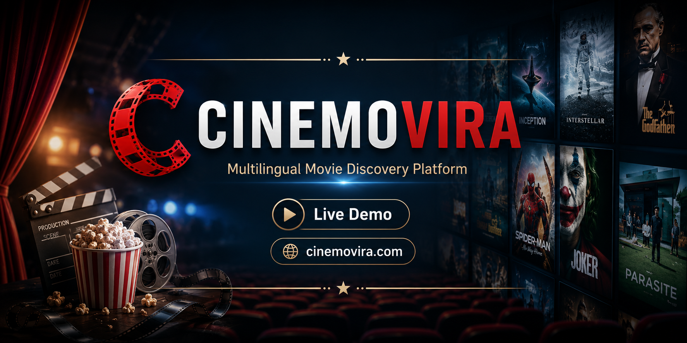
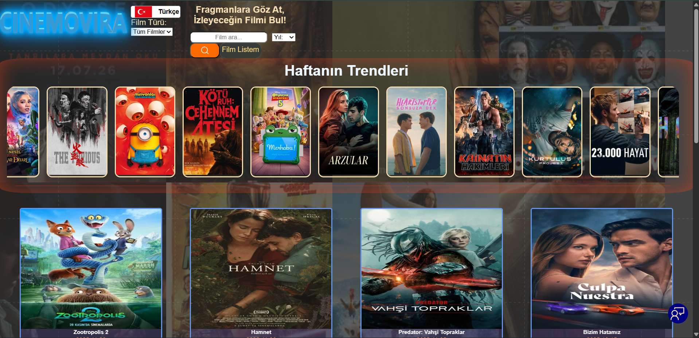
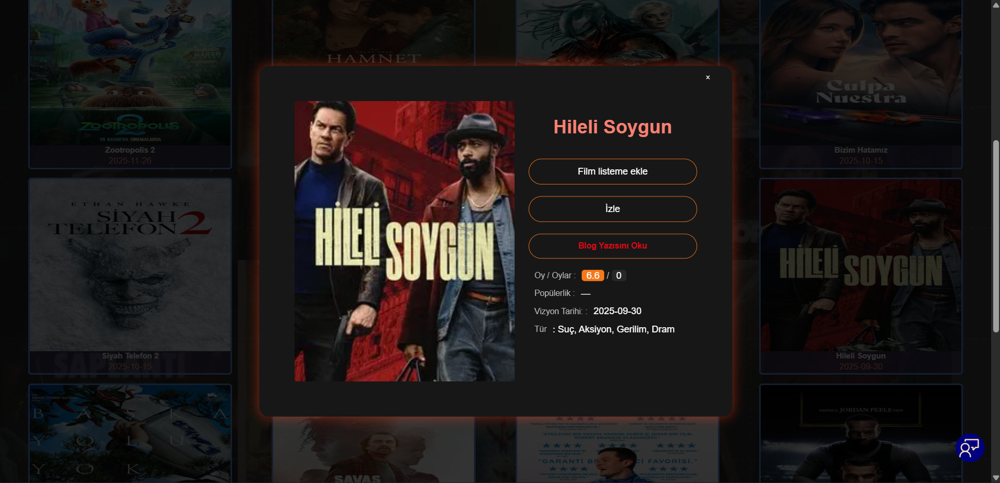
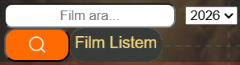
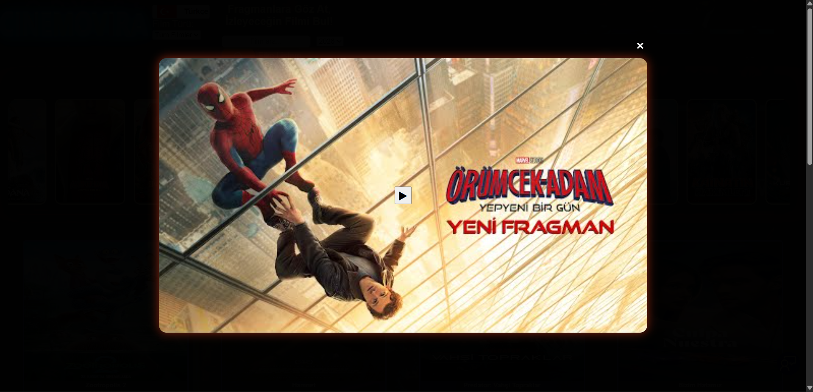

<p align="center">
  
</p>

<h1 align="center">🎬 Cinemovira</h1>

<p align="center">
Multilingual Movie Discovery Platform
</p>

<p align="center">

<a href="https://cinemovira.com">🌐 Live Demo</a> •
<a href="#features">✨ Features</a> •
<a href="#architecture">🏗 Architecture</a> •
<a href="#screenshots">📸 Screenshots</a>

</p>

---

> 🚀 **Production-ready multilingual movie discovery platform built with Next.js, Node.js, Express.js, MongoDB, Redis, TMDB API, and YouTube API.**

---

# 📖 About

Cinemovira is a production-ready multilingual movie discovery platform designed to help users discover movies through a fast, responsive, and SEO-friendly experience.

The project combines a modern frontend architecture with a scalable backend, focusing on performance, maintainability, caching, and clean software design.

Although the source code is private, this repository showcases the project's architecture, technical decisions, and implemented features.

---

## 📸 Screenshots

### 🏠 Home



---

### 🎬 Movie Details



---

### 🔍 Search



---

### ▶️ Trailer



---

## ✨ Features

- 🌍 Multi-language support
- 🎬 TMDB API integration
- ▶️ YouTube trailer integration
- 🔍 Advanced movie search
- 🎭 Genre filtering
- ⭐ Similar movie recommendations
- 📱 Responsive design
- ⚡ Server-side rendering (SSR)
- 🔍 SEO optimized pages
- 🗺 Dynamic sitemap generation
- 📄 Dynamic metadata
- 🚀 Redis caching

---

## 🚀 Tech Stack

### Frontend

- Next.js
- React
- JavaScript
- CSS

### Backend

- Node.js
- Express.js
- MongoDB
- Redis

### External APIs

- TMDB API
- YouTube API

---

## 🏗 Architecture

```text
                     User
                       │
                       ▼
                 Next.js Frontend
                       │
                       ▼
                Express REST API
                       │
        ┌──────────────┴──────────────┐
        ▼                             ▼
    Redis Cache                  MongoDB
        │
        ▼
      TMDB API
```

---

## 🔍 SEO

- Dynamic Metadata
- Server-Side Rendering
- Dynamic Sitemap
- Robots.txt
- Open Graph
- Canonical URLs
- JSON-LD Structured Data

---

## ⚡ Performance

- Redis caching
- Optimized API requests
- Image optimization
- Lazy loading
- Server-side rendering
- Reduced API latency

---

## 🛣 Roadmap

- User authentication
- Personal watchlist
- Favorites synchronization
- User ratings
- AI-powered movie recommendations
- Personalized profiles

---

## 📌 Note

The Cinemovira source code is private because the project is actively maintained and continuously developed.

This repository is intended to present the project's architecture, features, technologies, and overall engineering approach without exposing the production source code.

---

## 🌐 Live Demo

https://cinemovira.com